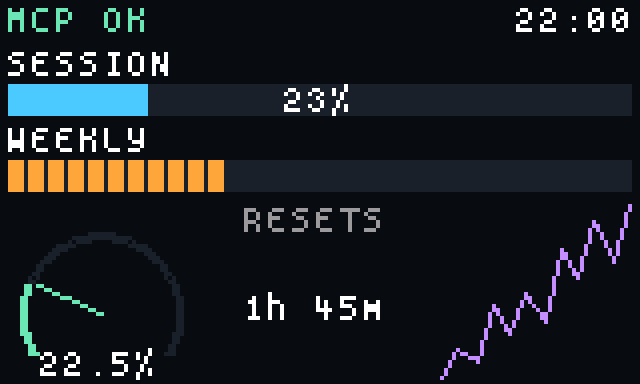
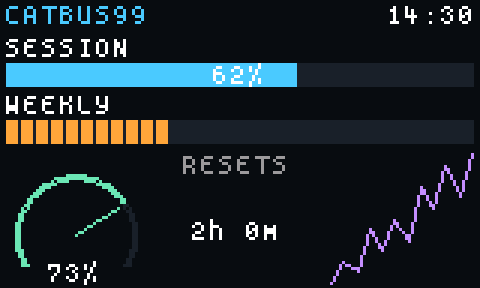
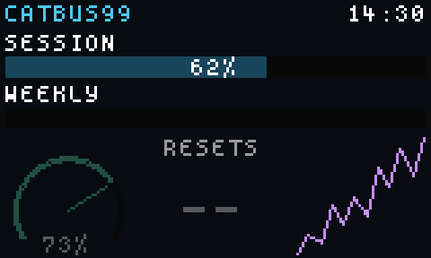

# catbus99

[](https://github.com/terraboops/catbus99/actions/workflows/ci.yml)
[](LICENSE)

**Put live data on your Epomaker TH99 Pro's screen — from macOS, from a script, or from an AI agent.**

The TH99 Pro ships with a 160×96 TFT and a Windows-only driver. catbus99 drives that screen
from macOS (and Linux) over the keyboard's existing USB-HID interface. No firmware
modification, no reflashing, no QMK.



*Live screen, shown at 4×. The label was set by an AI agent over MCP; the bars, gauge and
countdown come from a shell script on a cron schedule.*

```sh
catbus99 daemon &                       # owns the display
catbus99 set demo cpu 73 --render       # push a value, draw it
catbus99 image cat.gif --execute        # or just show a GIF
claude mcp add catbus99 -- catbus99 mcp # or let an agent drive it
```

---

## The constraint that shapes everything

The display's storage is a **Puya PY25Q128HA** rated at **100,000 program/erase cycles**,
and it is not replaceable. Every visible change spends one.

That single fact drives the entire architecture, because it makes the obvious design wrong.
A clock that ticks every minute would destroy the panel in about **69 days**:

| What you display | Image changes/day | Projected panel life |
| --- | --- | --- |
| `20:17` — 1-minute clock | 1,440 | **~69 days** |
| `20:15` — 5-minute clock | 288 | ~1 year |
| `20:15` — 15-minute clock (default) | 96 | ~2.9 years |
| `~8pm` — 30-minute clock | 48 | ~5.7 years |

The insight that makes this workable: **cost is driven by display *resolution*, not poll
rate.** catbus99 never uploads an image identical to the one already on screen, so if you
render time rounded to 15 minutes, the pixels only change 96 times a day no matter how
often the daemon polls. Poll every second if you like — it's free. It's the *rendering*
that must be coarse.

So time widgets quantise by default:

```rust
Widget::Clock { format: "%H:%M", quantize_minutes: 15, .. }  // renders 20:15, not 20:17
```

Precision is a cost, not just a display choice. See [docs/FLASH_BUDGET.md](docs/FLASH_BUDGET.md).

### The write governor

Every write passes through one governor that enforces:

- **Change-skip** — a byte-identical image is never re-sent, in any lane, persisted across runs
- **Interval floor** — configurable, with a hard 5-minute minimum that config cannot lower
- **Interactive burst** — a separate bounded hourly allowance, so iterating on a layout
  doesn't eat the scheduled budget
- **Odometer** — every upload counted and persisted, including failed ones (a transfer that
  dies halfway still wrote flash)

```console
$ catbus99 wear
  uploads so far:   22
  budget used:      0.0220% of 100000 rated cycles
  uploads left:     99978
```

This is **enforced by the compiler, not by convention.** The raw upload function is
crate-private; `Governor::upload_to_panel` is the only public way to put pixels on the
panel, anywhere in the codebase. There is deliberately no `--force`.

Two other designs were tried and rejected — a capability token (the permit's constructor
must be public for the governor to mint one, so anyone can) and a Cargo feature (features
unify across a build graph). Rust's privacy is per-crate, so the raw write and the policy
guarding it live in the same crate. Details in [docs/DESIGN.md](docs/DESIGN.md).

---

## Install

**Requires:** macOS or Linux, a TH99 Pro connected by **USB cable** (the screen is
unreachable over 2.4 GHz or Bluetooth), and Rust 1.82+.

```sh
git clone https://github.com/terraboops/catbus99
cd catbus99
cargo build --release
./target/release/catbus99 probe
```

`probe` opens nothing and writes nothing. It should find both interfaces:

```console
$ catbus99 probe
  iface  2  usage_page 0xff68  usage 0x0061  Epomaker TH99PRO
  iface  3  usage_page 0xff67  usage 0x0061  Epomaker TH99PRO
  OK: both interfaces identified unambiguously.
```

Close Epomaker's own driver first — it holds the interface exclusively.

### Check it works

```sh
catbus99 selftest --execute --pattern
```

Expect four horizontal bands (red, green, blue, white), a black square in the **top-left**,
and a thin white border. That pattern is deliberately asymmetric and multi-coloured: colour
bands reveal stride faults, the off-centre marker reveals flips and rotations, and the
border reveals off-by-one errors.

---

## Usage

### Show an image or GIF

```sh
catbus99 image photo.png --preview out.png     # render only, no flash write
catbus99 image cat.gif --execute               # display it
catbus99 image cat.gif --hold-first 2000 --execute
```

`--hold-first` exists because of a protocol quirk: the container carries N frames but only
**N−1 single-byte delays**, so no frame can be held longer than 255 units. A cat that blinks
every two seconds isn't expressible as two frames at any delay value. catbus99 represents
long holds by *duplicating* frames, choosing the largest tick that reproduces your timing
exactly.

### Build a screen from widgets



Layouts are TOML or JSON — named slots on the 160×96 grid, each holding one widget:

```toml
id = "usage"
background = "#0a0c10"

[[slots]]
id = "session"
rect = { x = 2, y = 12, w = 156, h = 17 }

[slots.widget]
type = "progress_bar"
show_value = true
color = "#4ac8ff"
value = { kind = "data_point", source = "claude", key = "session_pct" }
label = { kind = "literal", value = "SESSION" }
```

A complete, working example lives in
[`examples/layouts/usage.toml`](examples/layouts/usage.toml).

```sh
catbus99 layout examples/layouts/usage.toml --preview out.png
catbus99 layout my-screen.toml --execute
catbus99 layout --schema > layout.schema.json   # JSON Schema for editor completion
```

Widgets: `label`, `progress_bar` (solid or segmented), `gauge`, `reset_timer`, `clock`,
`image`, `sparkline`, `fill`, `blank`.

**Widgets bind to data, they don't embed it.** A widget holds a *reference* to a reading, so
one layout renders to the panel, to a PNG preview, or anywhere else, with values resolved at
render time.

### Stale data looks stale



A reading past its TTL renders **dimmed** with `--` in place of text. On a glanceable,
non-interactive display, a number that has silently stopped updating is worse than no
number — you have no way to tell.

### Feed it from your own scripts

Any executable, in any language. Exit 0 and print JSON:

```sh
#!/usr/bin/env bash
echo '{"datapoints":[{"key":"session","value":0.62,"unit":"ratio","label":"SESSION"}]}'
```

```toml
# ~/.config/catbus99/sources.toml
[[source]]
id       = "claude"
command  = ["~/bin/claude-usage.sh"]
schedule = "0 */5 * * * *"    # cron, with seconds
ttl_secs = 900
```

A subprocess contract rather than a plugin API, deliberately: a Rust plugin interface would
have restricted you to Rust. Your existing shell, Python or Swift script works untouched.
See [docs/SOURCES.md](docs/SOURCES.md).

### Let an agent drive it

```sh
claude mcp add catbus99 -- catbus99 mcp
```

Fourteen MCP tools. The important design property: the MCP server holds no device handle
and contains no write logic — every tool is a thin client over the daemon's socket, so an
agent **inherits the flash-endurance limits automatically**.

`preview_screen` renders a PNG and costs nothing, so an agent can iterate freely. Writes
report the governor's verdict rather than a bare success:

```json
{ "uploaded": false, "reason": "rate_limited",
  "detail": "next scheduled write allowed in 7m 12s",
  "retry_after_secs": 432, "uploads_remaining": 99978 }
```

That teaches batching instead of blind retrying. `uploaded` always means bytes actually
reached the panel — a dry run reports `would_upload`, never `true`. See [docs/MCP.md](docs/MCP.md).

### Keymap backup

```sh
catbus99 keymap --out base-layer.json     # read-only
catbus99 keymap --fn-layer
```

The table is the firmware's **16×7 key matrix**, not the visual layout. Entries whose
meaning we haven't established are preserved verbatim rather than guessed at, so a backup
round-trips byte-for-byte. Restore is deliberately not implemented.

---

## How it works

```
   MCP client        CLI          cron schedule
        │             │                │
        └─────────────┴────────────────┘
                      │  Unix socket, newline-delimited JSON
              ┌───────▼────────┐
              │   catbus99d    │  owns the device
              │  data points   │
              │  layout        │
              │  renderer      │
              │  WRITE GOVERNOR│  ← the only path to flash
              └───────┬────────┘
                      │  USB-HID
              MI_02 config · MI_03 TFT
```

One process owns the display. Everything else — the CLI, the MCP server — is a thin client.
That isn't ceremony: if each wrote directly, every one could satisfy its own rate limit while
together tripling the write rate, and the odometer would undercount.

| Crate | Role |
| --- | --- |
| `catbus99-proto` | Wire format. **Pure, zero I/O**, so the whole protocol is testable in CI with no keyboard. |
| `catbus99-device` | USB-HID transport **and** the write governor — together, so privacy enforces the invariant |
| `catbus99-model` | Typed layouts and widgets (serde + schemars) |
| `catbus99-render` | Compositor, RGB565, bitmap text, animation timing |
| `catbus99-daemon` | Control protocol, source scheduler, socket server |
| `catbus99-mcp` | MCP tools, thin clients over the socket |

---

## What we found out about the hardware

Full detail in [docs/PROTOCOL.md](docs/PROTOCOL.md). Highlights, all verified against live
captures of Epomaker's own driver and confirmed on-panel:

**There is a clear-screen operation.** It isn't a special command — it's a single-frame
all-black image upload, and it costs a flash write like anything else. (Upstream documented
that no clear existed.)

**A still image can use one frame, not two.** The official driver writes stills as two
identical frames — 16 reports, 65,536 bytes. One frame displays fine and costs **half the
bytes**.

**There is no display-mode command.** Nothing returns the panel to its native clock screen;
once you upload an image you own the screen until a power cycle. So the keyboard cannot be
asked to render the time itself while catbus99 is using the display — which is exactly why
quantisation matters.

**An outline font is the wrong tool at this size.** Measured across 220 sizes, a scaled
pixel font never rasterised better than 74% "crisp", and only at ~20px — far too tall for a
96px panel. Thresholding deleted glyph stems; alpha blending looked fine in a magnified
preview and was grey mush on glass. catbus99 ships an embedded 5×8 bitmap font instead:
pixel-grid glyphs, integer scaling only, no anti-aliasing. On a display this small, contrast
beats letterform fidelity.

**macOS hidapi aborts if the thread that called `hid_init()` exits.** Measured directly:
init on a thread that exits → SIGTRAP; init on a long-lived thread → fine. catbus99
initialises on a dedicated thread that parks forever. This is a real hazard for any async
program — tokio's blocking-pool threads are retired after an idle timeout.

---

## Status

**Works, verified on hardware:** transport on macOS, images and animated GIFs, the widget
compositor, the write governor and odometer, the data-source scheduler, the MCP server,
clock sync, keymap backup.

**Not done:** keymap restore, `launchd` service install, Homebrew/crates.io packaging,
per-widget dithering, `spawn_blocking` for uploads (the daemon is unresponsive during a
large animation upload).

**Unresolved:** the delay byte's units. Every capture carried `0x19` while the driver's UI
read 50ms, so animation timing is approximate. Frame duplication sidesteps it — with a
uniform tick, which frame a delay applies to stops mattering.

**Tested on** a single TH99 Pro (firmware V1.17) on macOS 15, Apple Silicon. The full test
suite runs on Linux and macOS in CI, but **no Linux machine has driven a real keyboard yet** —
the suite deliberately needs no hardware, so a green build says the code compiles and behaves,
not that the panel lit up. If you try it on Linux, or on a different unit or firmware,
`catbus99 probe --json` in an issue is genuinely useful.

---

## Development

```sh
cargo test                                    # 205 tests, no keyboard required
cargo clippy --all-targets -- -D warnings
```

No test needs hardware. Device-touching code is exercised for *shape* — that a probe
returns, that an open succeeds or fails cleanly — never for a successful upload.

There's a **visual regression harness**: scenes render at a fixed timestamp with fixed data
and compare byte-for-byte against committed golden PNGs, writing `.actual.png` and
`.diff.png` (changes in magenta) on failure.

```sh
CATBUS99_BLESS=1 cargo test -p catbus99-render --test regression   # regenerate goldens
```

It's self-tested: shifting the stale-dim factor by 1% — invisible in a thumbnail — fails
with 740 changed pixels. See [docs/TESTING.md](docs/TESTING.md) and
[CONTRIBUTING.md](CONTRIBUTING.md).

---

## Safety

catbus99 writes to a **finite, unreplaceable** flash. It defaults to conservative limits and
counts every write, but it is unofficial software talking to undocumented firmware. It never
sends firmware, reset, macro, or lighting commands, and the only writes it performs are
image uploads (`AA 50`), the clock (`AA 34`), and — if you explicitly implement it —
keymaps. **Use at your own risk.**

## Credits

Protocol discovery by **[regenbildr](https://github.com/regenbildr)**. Full attribution,
prior art, and third-party licences in [CREDITS.md](CREDITS.md).

Unofficial; not affiliated with or endorsed by Epomaker.

## Licence

MIT — see [LICENSE](LICENSE).
